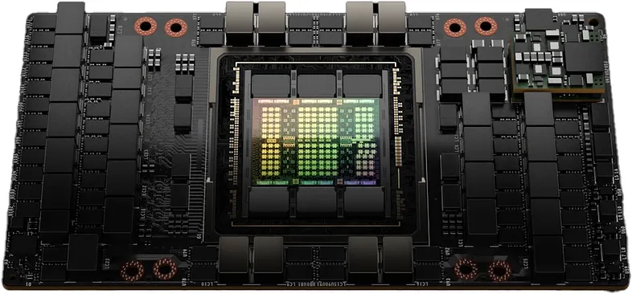

# H100 GPU Architecture

## Overview

H100 is the first truly asynchronous GPU which extends A100's (A100 is the previous generation GPU from NVIDIA) global-to-shared asynchronous transfers across all address spaces enabling applications to build end-to-end asynchronous pipelines that move data into and off the chip completely overlapping and hiding data movement with computation.

H100 is not just a faster GPU, it's a specialized AI supercomputer on a chip. By combining the Transformer Engine for speed, HBM3 for data flow, and NVLink for scaling, it allows companies to train AI models in days that used to take months.

## Core Hardware Components and Features

- **Streaming Multiprocessor (SM):** The brain of the GPU. A single GPU contains many SMs. They handle the actual execution of the code.
- **Tensor Cores:** These are the hardware units inside the SMs, designed specifically for matrix mathematics.
- **CUDA Cores:** These are general purpose processors, where Tensor Cores do the heavy mathematical lifting for AI, CUDA cores handle the broader programming tasks.
- **High Bandwidth Memory (HBM3):** This is the RAM of the GPU. This HBM3 allows the GPU to move data 3TB/s. Hence, prevents the processor from starving for data while working.
- **Transformer Engine:** Uses hardware and software to intelligently choose the right *precision* for calculations. It can swap between FP8 and FP16 on the fly to speed up AI training by up to 9x without losing accuracy.
- **DPX Instructions:** Specialized commands that accelerate **Dynamic Programming (used in genomics and robotics)** algorithms by up to 7x.
- **NVLink:** A high-speed bridge that allows multiple GPUs to talk to each other directly, this is much faster than the PCIe found in home computers.
- **NVSwitch:** A physical chip that acts like a high-speed traffic controller, connecting hundreds of GPUs together into one giant SuperPOD so they can work without any jamming.
- **Multi-Instance GPU (MIG):** This allows one physical H100 to be partitioned into 7 smaller isolated GPU units. This is useful for cloud providers who want to rent out small pieces to users.
- **Thread Block Cluster:** A new way of grouping tasks. This allows different parts of the GPU to collaborate and share data, reducing the dependency on using the main memory.
- **Distributed Shared Memory:** This allows SMs to write directly into the memory of other SMs. Previously they had to go through the main memory to talk to each other.
- **Asynchronous Execution:** This allows the GPU to move data and perform calculations at the exact same time. In older GPUs before the H100, the processor often had to wait for data to arrive before it could start working.